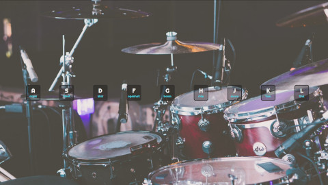

# JavaScript Drum Kit
play drums with your keyboard.

## Notes
### HTML5
- use of [data attributes](https://developer.mozilla.org/en-US/docs/Learn/HTML/Howto/Use_data_attributes) for storing extra information that doesn't have any visual representation.
- [`<audio>`](https://developer.mozilla.org/en-US/docs/Web/HTML/Element/audio) tag is used to embed sound in document.

## JavaScript
- we used `.addEventListener()` method on window, and key elements to listen to events.
- we got familiar with `keydown` and `transitionend` events.
- we saw that we can use `target.classList.add()` to add a class to a target element. there are also `remove()` and `toggle()` methods.
- we used `audio.play()` to play an audio, we also used `audio.currentTime(0)` on the audio element to rewind the audio to the beginning.