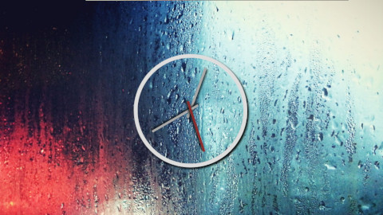

# CSS + JS Clock
A beautiful clock using CSS and JavaScript.

## Notes
### CSS
- using `transform-origin` property to set the origin of rotation of an element.
- use of `cubic-bezier` function for transition (with the help of developer tools).

### JavaScript
- we used `HTMLElement.style.transform` to set the transition property of a target element. Syntax is fairly simple and it can be used for any other property.

## References
- [transition-timing-function](https://developer.mozilla.org/en-US/docs/Web/CSS/transition-timing-function)
- [Easing Functions Cheat Sheet](https://developer.mozilla.org/en-US/docs/Web/CSS/CSS_Transitions/Using_CSS_transitions)
- [HTMLElement.style](https://developer.mozilla.org/en-US/docs/Web/API/HTMLElement/style)
