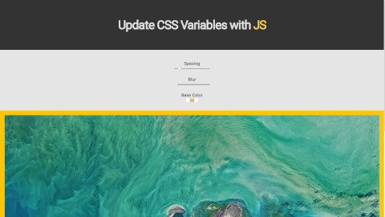

# Playing with CSS Variables and JS

Changing CSS variables with JavaScript.

## Notes

### CSS

- CSS variables (actually CSS custom properties) can be used to assign values for later use in other properties.
- `filter` property applies various graphical effects like blur or contrast to an element.

### JavaScript

- We used two new events. `change` which will be trigered when a value input changes and `mousemove` which trigers when you move the mouse on the element.
- data attributes can be accessed using the `HTMLelement.dataset` in javascript.
- We can change the variables that we have defined on the `:root` element with `document.documentElement.style.setProperty()`

## References

- [Using CSS custom properties (variables)](https://developer.mozilla.org/en-US/docs/Web/CSS/Using_CSS_variables)
- [filter](https://developer.mozilla.org/en-US/docs/Web/CSS/filter)
- [change](https://developer.mozilla.org/en-US/docs/Web/Events/change)
- [mousemove](https://developer.mozilla.org/en-US/docs/Web/Events/mousemove)
- [HTMLElement.dataset](https://developer.mozilla.org/en-US/docs/Web/API/HTMLElement/dataset)
