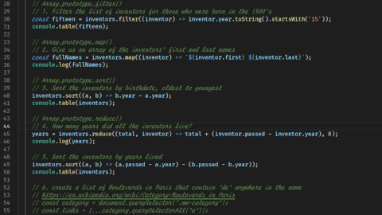

# Array Cardio Day 1
Learn about arrays and its methods in JS

## Notes
### JavaScript
- We used `Array.prototype.filter()`, `Array.prototype.sort()`, `Array.prototype.reduce()` and `Array.prototype.map()` to work with arrays.

## References
- [Array.prototype.filter()](https://developer.mozilla.org/en-US/docs/Web/JavaScript/Reference/Global_Objects/Array/filter)
- [Array.prototype.sort()](https://developer.mozilla.org/en-US/docs/Web/JavaScript/Reference/Global_Objects/Array/sort)
- [Array.prototype.reduce()](https://developer.mozilla.org/en-US/docs/Web/JavaScript/Reference/Global_Objects/Array/Reduce)
- [Array.prototype.map()](https://developer.mozilla.org/en-US/docs/Web/JavaScript/Reference/Global_Objects/Array/map)