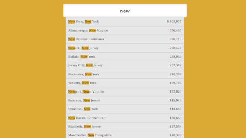

# Ajax Type Ahead

Fetch json and load data while typing in an input field.

## Notes

### JavaScript

- We used the new global `fetch()` function to fetch a json file. this function returns a `Promise`.
- We used `RegExp` constructor to create a regular expression object and test it.

## References

- [WindowOrWorkerGlobalScope.fetch()](https://developer.mozilla.org/en-US/docs/Web/API/WindowOrWorkerGlobalScope/fetch)
- [Fetch API](https://developer.mozilla.org/en-US/docs/Web/API/Fetch_API)
- [The Body mixin of the Fetch API](https://developer.mozilla.org/en-US/docs/Web/API/Body)
- [Promise](https://developer.mozilla.org/en-US/docs/Web/JavaScript/Reference/Global_Objects/Promise)
- [RegExp](https://developer.mozilla.org/en-US/docs/Web/JavaScript/Reference/Global_Objects/RegExp)
